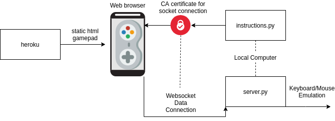

# iWiimote


## Things you'll need

### Python

Use python 3.
Run `pip install -r requirements.txt` to get the necessary python packages

### Openssl
Make sure you have the most up to date version of openssl (1.1.1c or higher). You can check this by running `openssl version` in your command line.


### 1. Generate Certification for websockets
To establish the connection for the game controller, we must generate some certificates.
There are two versions of the shell script for doing so, one for Windows:
```bash
generateCerts.sh IP
```
and one for Linux:
```bash
./generateCertsLinux.sh IP
```
Run this command in the root directory of this project, where IP is your active local IP address.
For example, 
```bash
generateCerts.sh 192.168.1.3`.
```

This script will use openSSL to generate self-signed certificates to allow the
controller to connect over your local network.

### 2. Start instructions server
If you haven't done this before, you'll want the instructions server.
```bash
cd server
python start.py
```

On your mobile phone,
scan the QR code and go to the website on your local network for instructions. 
The webpage will walk you through installation of the certificates you generated in the firs step.

### 3. Start the controller server
You can now run the server that establishes the controller connection.
You may need to close the terminal every time you need to restart the server.
To start the server on Windows, run the below command.
```bash
cd server
python controller.py
```
On linux, the keyboard emulation library we used needs access to `/dev/`, so run
```bash
cd server
sudo python controller.py
```
Depending on your installation you may have to `sudo pip install -r requirements.txt`.

The python script will detect your active IP address and host a websocket server
on port 12000.

If you are using the instruction server, follow the link.
Otherwise, navigate to `https://iwiimote.herokuapp.com/?ipAddr=IP:12000`,
where IP is your active IP address

### 4. Navigating the Controller Website
The website is effectively your controller. The Instructions server will generate a link to the website with the correct query parameter to `ipAddr`. https://iwiimote.herokuapp.com/?ipAddr=IP:12000


To get iWiimote to work, first hit the "Give permissions" button in the center of the controller,
and accept the appropriate dialog box.
This allows iWiimote access to the gyroscope so you can use it as a pointer.

Next, hit the ON button. If the connection is successful, the button will turn green,
and the `controller.py` server should print "Phone connected".

Try pressing the d-pad, or using the dropdown to select pointer mode. Not working?
Create a Github issue and we'll look at it.

### Data Flow



You might be wondering, why on earth did we do it this way?
See the implementation section of [our paper](iWiimote.pdf).
